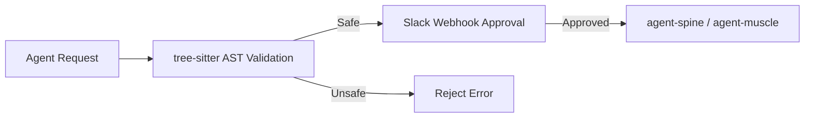

# agent-mouth

**Communication and approvals — Slack webhooks with AST-safe command validation.**

Part of the **[Autonomic AI](https://github.com/autonomic-ai-dev/agent-body)** ecosystem. Sends webhook notifications and validates approval payloads (e.g. blocking `rm -rf` in shell snippets) before agent-spine or muscle act on them.

| Standalone | Integrated |
|------------|------------|
| `agent-mouth send` | `POST /webhook/slack/approval` |
| `agent-mouth validate --command` | Spine registration on **3104** |
| Log summarization | `[mouth]` in unified config |

---

## Why agent-mouth?

| Problem | agent-mouth answer |
|---------|-------------------|
| Dangerous shell in agent plans | **`validate --command`** — tree-sitter bash AST gate |
| Humans need approve/deny | **Slack webhook** — ChatOps before deploy nodes |
| Logs are too long for humans | **`summarize`** — stdin log compression |
| No outbound notify channel | **`send`** — webhook POST for status |



---

## Quick Install

```bash
curl -fsSL https://raw.githubusercontent.com/autonomic-ai-dev/agent-mouth/master/scripts/install.sh | bash
# or full stack:
curl -fsSL https://raw.githubusercontent.com/autonomic-ai-dev/agent-body/master/scripts/install-all-organs.sh | bash
```

Verify:

```bash
agent-mouth version
agent-mouth status
agent-mouth validate --command "echo hello"
```

---

## Main features

| Feature | Setup | Why use it |
|---------|-------|------------|
| **AST validation** | `validate --command` | Block destructive commands before exec |
| **Slack approvals** | `serve` + webhook URL | Human-in-the-loop ChatOps |
| **Outbound notify** | `send <message>` | Pipeline status to Slack/Discord |
| **Log summarize** | `summarize` (stdin) | Operator-friendly log digests |
| **HTTP daemon** | `:3104` | Spine workflow integration |

---

## Commands

| Command | Description |
|---------|-------------|
| `serve` | HTTP daemon with webhook routes |
| `send <message>` | POST to configured webhook URL |
| `validate --command\|--script` | tree-sitter bash AST gate |
| `summarize` | Summarize piped log input |
| `status` | Config and webhook target |

---

## HTTP API

| Endpoint | Description |
|----------|-------------|
| `GET /health` | Daemon health |
| `POST /webhook/slack/approval` | Validated approval payload |
| `POST /send` | Outbound notification |

---

## Configuration

Section `[mouth]` in `~/.autonomic/config.toml` (default port **3104**).

---

## Local setup

```bash
git clone https://github.com/autonomic-ai-dev/agent-mouth.git && cd agent-mouth
cargo build --release -p agent-mouth
agent-mouth validate --command "cargo test"
echo "2026-06-20 ERROR timeout" | agent-mouth summarize
```

---

## Development

```bash
cargo test --release -p agent-mouth
```

---

## License

MIT
