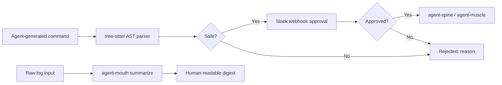

# agent-mouth — API Gateway & Command Validation

**Cloud-Native role: Ingress / API gateway** — AST command validation, API routing, Slack webhooks, and log summarization.

`agent-mouth` is the **Ingress API Gateway** for the Autonomic cluster. All external requests—whether from Cursor, Opencode, a web dashboard, or a Slack webhook—flow through `agent-mouth` before reaching internal daemons like `agent-spine` or `agent-muscle`. 

---

## Under the Hood: How it Works

Because agents generate untrusted commands and users need real-time feedback, `agent-mouth` acts as a strict validation and routing layer:

1. **Pre-Execution AST Validation**
Before `agent-muscle` is allowed to execute a bash command, `agent-mouth` parses the command using a `tree-sitter` AST parser. It evaluates the command against a strict security policy. Safe commands pass instantly. Dangerous commands (like `rm -rf /` or `> /dev/sda`) are rejected at the parser level with a structured JSON error, *before* they ever hit a shell.

2. **WebSocket & SSE Real-time Streaming**
`agent-mouth` translates internal NATS JetStream events into external-facing WebSocket and Server-Sent Events (SSE) streams. This allows external React dashboards to visualize agent progress in real-time without needing to connect directly to the NATS broker.

3. **Human Approval (Webhooks)**
For workflows that reach an `ApprovalGate`, `agent-mouth` dispatches a Slack webhook containing the context and waits for a cryptographic approve/deny callback from the user before resuming the DAG.



---

## Standalone vs Integrated

| Mode | What you type | What happens |
|------|--------------|--------------|
| **Standalone** | `agent-mouth validate --command "cargo test"` | AST validation: passes (safe) |
| **Standalone** | `agent-mouth validate --command "rm -rf /"` | AST validation: rejected (dangerous) |
| **Standalone** | `agent-mouth send "Build complete"` | Send webhook notification |
| **Standalone** | `echo "ERROR timeout" \| agent-mouth summarize` | Summarize logs from stdin |
| **Integrated** | HTTP daemon on `:3104` | Spine registration and webhook routes |
| **Integrated** | agent-spine | ApprovalGate nodes delegate to mouth |
| **Integrated** | Slack integration | ChatOps before deploy/exec nodes |

In standalone mode, mouth is a CLI security and notification tool. In integrated mode, it runs as a daemon that agent-spine queries for command validation before execution, and sends webhooks for approval gates.

---

## Why agent-mouth?

| Problem | agent-mouth answer |
|---------|-------------------|
| Dangerous shell commands in agent plans | **`validate --command`** — tree-sitter AST gate rejects unsafe patterns |
| Humans must approve critical operations | **Slack webhook** — ChatOps approve/deny before deploy nodes |
| Logs are too long for operator review | **`summarize`** — stdin log compression into structured digest |
| No outbound notification channel | **`send`** — webhook POST for pipeline status and alerts |

---

## What you get

| Feature | Why use it |
|---------|------------|
| **AST command validation** | `validate --command` — block destructive commands before execution |
| **Slack approval webhooks** | `serve` + webhook URL — human-in-the-loop ChatOps |
| **Outbound notifications** | `send <message>` — pipeline status to Slack/Discord |
| **Log summarization** | `summarize` (stdin) — operator-friendly log digests |
| **HTTP daemon** | `:3104` — spine workflow integration |

---

## Commands

| Command | Description |
|---------|-------------|
| `agent-mouth serve` | HTTP daemon with webhook routes on port 3104 |
| `agent-mouth mcp` | Start MCP stdio server (for gateway aggregation) |
| `agent-mouth send <message>` | POST to configured webhook URL |
| `agent-mouth validate --command\|--script` | Tree-sitter bash AST safety gate |
| `agent-mouth summarize` | Summarize piped log input |
| `agent-mouth status` | Show config, webhook targets, AST policy |

Global `--progress` (or `AGENT_PROGRESS=1`) enables structured ProgressTree CLI output.

---

## HTTP API

| Method | Endpoint | Description |
|--------|----------|-------------|
| `GET` | `/health` | Daemon health |
| `POST` | `/webhook/slack/approval` | Validated approval payload |
| `POST` | `/send` | Outbound notification |

---

## Quick Install

```bash
curl -fsSL https://raw.githubusercontent.com/autonomic-ai-dev/agent-mouth/master/scripts/install.sh | bash

# Or full stack:
curl -fsSL https://raw.githubusercontent.com/autonomic-ai-dev/agent-body/master/scripts/install-all-organs.sh | bash
```

Verify:
```bash
agent-mouth version
agent-mouth status
agent-mouth validate --command "echo hello"
```

---

## Configuration

Section `[mouth]` in `~/.autonomic/config.toml` (default port **3104**).

```toml
[mouth]
webhook_url = "https://hooks.slack.com/services/..."
```

---

## Development

```bash
git clone https://github.com/autonomic-ai-dev/agent-mouth.git && cd agent-mouth
cargo build --release -p agent-mouth
cargo test --release -p agent-mouth

# Test validation:
agent-mouth validate --command "cargo test"
echo "2026-06-20 ERROR timeout" | agent-mouth summarize
```

---

## License

MIT
