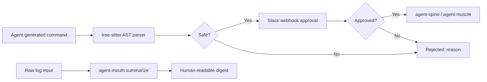

# agent-mouth — Communication and Approvals

**AST-based command validation, Slack webhook approvals, outbound notifications, and log summarization.**

agent-mouth is the **voice** of the Autonomic AI ecosystem. It handles all outward communication: validating shell commands against a tree-sitter AST policy (blocking `rm -rf /` before execution), sending Slack webhook approval requests for human-in-the-loop gates, dispatching outbound notifications, and compressing verbose log output into human-readable summaries.

The key design: **validate before you act.** Every command passes through a tree-sitter AST parser that evaluates safety rules before agent-spine or agent-muscle executes it. Dangerous commands are rejected at the validation layer, not at the shell.

---

## Core Concept

AI agents generate shell commands — and some of those commands are dangerous. A simple `rm -rf /` in a generated deployment script can destroy infrastructure. A `curl | bash` can introduce malware.

agent-mouth prevents these failures at three points:

1. **Pre-execution validation** — a tree-sitter AST parser evaluates bash commands against an approval policy. Safe commands (`echo`, `cargo test`, `ls`) pass instantly. Dangerous commands (`rm -rf`, `> /dev/sda`, `chmod -R 777 /`) are rejected with a clear reason.
2. **Human approval** — for commands that require discretion, mouth sends a Slack webhook with the command details and waits for approve/deny.
3. **Post-execution summarization** — verbose log output is compressed into structured summaries for operator consumption.



---

## Standalone vs Integrated

| Mode | What you type | What happens |
|------|--------------|--------------|
| **Standalone** | `agent-mouth validate --command "cargo test"` | AST validation: passes (safe) |
| **Standalone** | `agent-mouth validate --command "rm -rf /"` | AST validation: rejected (dangerous) |
| **Standalone** | `agent-mouth send "Build complete"` | Send webhook notification |
| **Standalone** | `echo "ERROR timeout" \| agent-mouth summarize` | Summarize logs from stdin |
| **Integrated** | HTTP daemon on `:3104` | Spine registration and webhook routes |
| **Integrated** | agent-spine | ApprovalGate nodes delegate to mouth |
| **Integrated** | Slack integration | ChatOps before deploy/exec nodes |

In standalone mode, mouth is a CLI security and notification tool. In integrated mode, it runs as a daemon that agent-spine queries for command validation before execution, and sends webhooks for approval gates.

---

## Why agent-mouth?

| Problem | agent-mouth answer |
|---------|-------------------|
| Dangerous shell commands in agent plans | **`validate --command`** — tree-sitter AST gate rejects unsafe patterns |
| Humans must approve critical operations | **Slack webhook** — ChatOps approve/deny before deploy nodes |
| Logs are too long for operator review | **`summarize`** — stdin log compression into structured digest |
| No outbound notification channel | **`send`** — webhook POST for pipeline status and alerts |

---

## What you get

| Feature | Why use it |
|---------|------------|
| **AST command validation** | `validate --command` — block destructive commands before execution |
| **Slack approval webhooks** | `serve` + webhook URL — human-in-the-loop ChatOps |
| **Outbound notifications** | `send <message>` — pipeline status to Slack/Discord |
| **Log summarization** | `summarize` (stdin) — operator-friendly log digests |
| **HTTP daemon** | `:3104` — spine workflow integration |

---

## Commands

| Command | Description |
|---------|-------------|
| `agent-mouth serve` | HTTP daemon with webhook routes on port 3104 |
| `agent-mouth send <message>` | POST to configured webhook URL |
| `agent-mouth validate --command\|--script` | Tree-sitter bash AST safety gate |
| `agent-mouth summarize` | Summarize piped log input |
| `agent-mouth status` | Show config, webhook targets, AST policy |

Global `--progress` (or `AGENT_PROGRESS=1`) enables structured ProgressTree CLI output.

---

## HTTP API

| Method | Endpoint | Description |
|--------|----------|-------------|
| `GET` | `/health` | Daemon health |
| `POST` | `/webhook/slack/approval` | Validated approval payload |
| `POST` | `/send` | Outbound notification |

---

## Quick Install

```bash
curl -fsSL https://raw.githubusercontent.com/autonomic-ai-dev/agent-mouth/master/scripts/install.sh | bash

# Or full stack:
curl -fsSL https://raw.githubusercontent.com/autonomic-ai-dev/agent-body/master/scripts/install-all-organs.sh | bash
```

Verify:
```bash
agent-mouth version
agent-mouth status
agent-mouth validate --command "echo hello"
```

---

## Configuration

Section `[mouth]` in `~/.autonomic/config.toml` (default port **3104**).

```toml
[mouth]
webhook_url = "https://hooks.slack.com/services/..."
```

---

## Development

```bash
git clone https://github.com/autonomic-ai-dev/agent-mouth.git && cd agent-mouth
cargo build --release -p agent-mouth
cargo test --release -p agent-mouth

# Test validation:
agent-mouth validate --command "cargo test"
echo "2026-06-20 ERROR timeout" | agent-mouth summarize
```

---

## License

MIT
